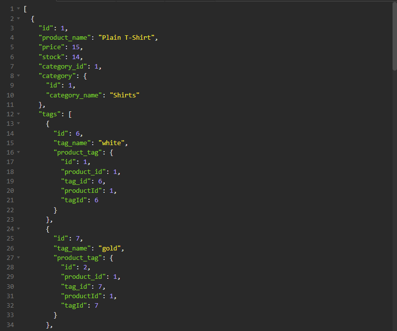

# E-Commerce-Backend

## Installation 
To install the project, clone the repository into your local device and install all the necssary components with 'npm i'. Installling Insomina is recommended to see and use the application. After installing Insomnia start the server by running 'npm start server'.

## Usage 
See video for usage instructions.
https://clipchamp.com/watch/s8Pg8RshPJ0

## Description 
This application was created for e-commerce business owners who would want to view and manage their products

## License
See repository

## Contributing 
N/A

## Questions
--GITHUB USERNAME--
ssangwang
--EMAIL--
ssangwang009@umn.edu

## Tests 
N/A